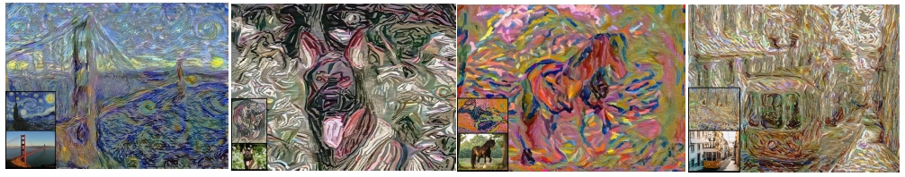
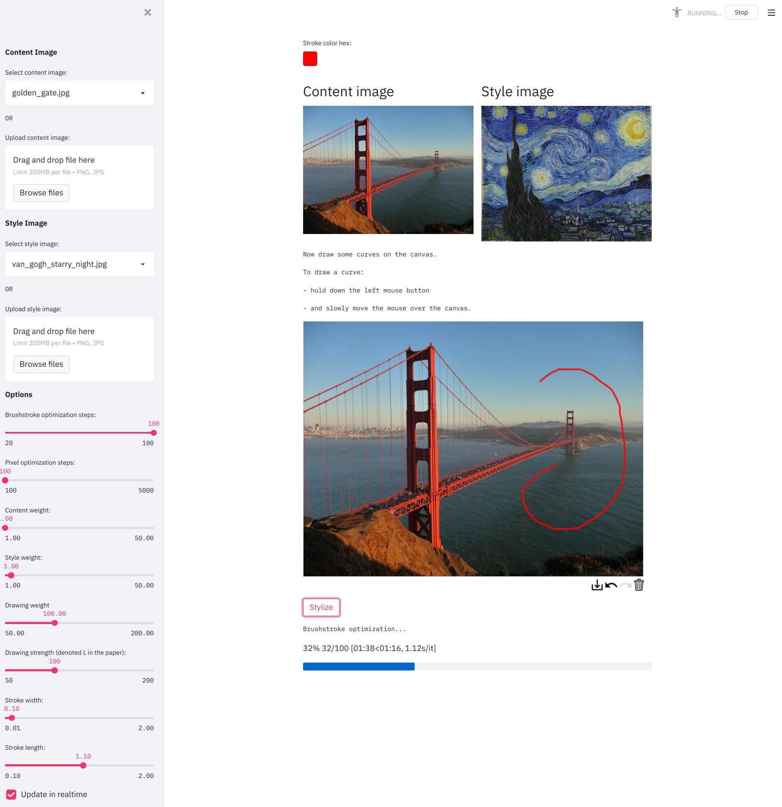

# Rethinking Style Transfer: From Pixels to Parameterized Brushstrokes (CVPR 2021)

<div align="center"></div>

### [Project page](https://compvis.github.io/brushstroke-parameterized-style-transfer/) | [Paper](https://arxiv.org/abs/2103.17185) | [Colab](https://colab.research.google.com/drive/1J9B6_G2DSWmaBWw9Ot80W9t7O6pWu8Kw?usp=sharing) | [Colab for Drawing App](https://colab.research.google.com/drive/1ALNRoZgCj35uJ3Xvs24-QDwwtCb2lm3P?usp=sharing)

Rethinking Style Transfer: From Pixels to Parameterized Brushstrokes.  
[Dmytro Kotovenko*](https://scholar.google.de/citations?user=T_U8yxwAAAAJ&hl=en), [Matthias Wright*](http://www.matthias-wright.com/), [Arthur Heimbrecht](http://www.aheimbrecht.de/), and [Björn Ommer](https://hci.iwr.uni-heidelberg.de/people/bommer).<br>
*&nbsp;denotes equal contribution <br>

## Installation
1. Clone this repository:
   ```sh
   > git clone https://github.com/CompVis/brushstroke-parameterized-style-transfer
   > cd brushstroke-parameterized-style-transfer
   ```
2. Install Tensorflow 1.14 (preferably with GPU support).  
   If you are using [Conda](https://docs.conda.io/en/latest/index.html), this command will create a new environment and install Tensorflow as well as compatible CUDA and cuDNN versions.
   ```sh
   > conda create --name tf14 tensorflow-gpu==1.14
   > conda activate tf14
   ```
3. Install requirements:
   ```sh
   > pip install -r requirements.txt
   ```

## Basic Usage
```python
from PIL import Image
import model

content_img = Image.open('images/content/golden_gate.jpg')
style_img = Image.open('images/style/van_gogh_starry_night.jpg')

stylized_img = model.stylize(content_img,
                             style_img,
                             num_strokes=5000,
                             num_steps=100,
                             content_weight=1.0,
                             style_weight=3.0,
                             num_steps_pixel=1000)

stylized_img.save('images/stylized.jpg')
```
or open [Colab](https://colab.research.google.com/drive/1J9B6_G2DSWmaBWw9Ot80W9t7O6pWu8Kw?usp=sharing).

## Drawing App
We created a [Streamlit](https://streamlit.io/) app where you can draw curves to control the flow of brushstrokes.

<div align="center"></div>

#### Run drawing app on your machine
To run the app on your own machine:
```sh
> CUDA_VISIBLE_DEVICES=0 streamlit run app.py
```


You can also run the app on a remote server and forward the port to your local machine:
[https://docs.streamlit.io/en/0.66.0/tutorial/run_streamlit_remotely.html](https://docs.streamlit.io/en/0.66.0/tutorial/run_streamlit_remotely.html)


#### Run streamlit app from Colab
If you don't have access to GPUs we also created a [Colab](https://colab.research.google.com/drive/1ALNRoZgCj35uJ3Xvs24-QDwwtCb2lm3P?usp=sharing) from which you can start the drawing app. 

## Other implementations
[PyTorch implementation](https://github.com/justanhduc/brushstroke-parameterized-style-transfer) by [justanhduc](https://github.com/justanhduc).

## Citation
```
@article{kotovenko_cvpr_2021,
    title={Rethinking Style Transfer: From Pixels to Parameterized Brushstrokes},
    author={Dmytro Kotovenko and Matthias Wright and Arthur Heimbrecht and Bj{\"o}rn Ommer},
    journal={CVPR},
    year={2021}
}
```

